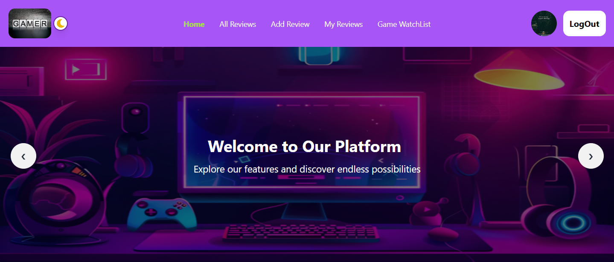

# Chill Gamer: A Game Review Application



## 📊  Project Overview

**Chill Gamer** is a user-friendly game review platform designed for users to explore, submit, and manage game reviews. The application focuses on simplicity, responsiveness, and functionality, offering key features such as user authentication, review submission, rating, and game watchlist management. Its purpose is to provide a space for users to share gaming experiences, interact with fellow gamers, and easily manage their personal game collections with an intuitive, clean UI.


🚀 Live Demo: [Chill Gamer](https://fluffy-rabanadas-4c83a2.netlify.app/)

---

## 📖 Table of Contents
- [Features](#features)
- [Technology Stack](#technology-stack)
- [Prerequisites](#prerequisites)
- [Installation](#installation)
- [Configuration](#configuration)
- [Troubleshooting](#troubleshooting)
- [Live Demo](#live-demo)
---

## ✨ Features
🔐 Protected Routes with Firebase Authentication  
- Users must be authenticated to:  
  - Add, update, and delete game reviews.  
  - Access their personal watchlist.  

📝 Dynamic Review System  
- Users can perform CRUD operations (Create, Read, Update, Delete) on game reviews, including:  
  - Detailed descriptions  
  - Ratings  
  - Genres  
  - Publishing year  

⭐ Highest Rated Games Section  
- Displays the top six highest-rated games dynamically fetched from MongoDB and showcased on the homepage.  

🎮 Game Watchlist  
- Users can add games to their personal watchlist and remove them as needed.  

🗄 MongoDB Integration  
- Data is fetched and managed directly from MongoDB, ensuring data persistence and easy scalability.  

🔎 Sorting and Filtering  
- Users can:  
  - Sort reviews by rating or publishing year  
  - Filter them by genre on the "All Reviews" page  

🎨 Responsive Design  
- Fully responsive layout, ensuring a seamless experience across devices.  

🌙 Dark/Light Theme Toggle  
- Provides a customizable visual experience with light and dark modes.  

⚡ Enhanced User Interaction  
- Uses React-simple-typewriter for engaging animated text effects.  
- Utilizes React-tooltip for interactive tooltips on user avatars and other elements.  

---

## 🏗️ Technology Stack


|  Category            | Technology / Library |
|---------------------|---------------------|
| Frontend                   | React, Vite, TailwindCSS, DaisyUI                |
| Backend                    | Express.js (If applicable)                       |
| Database                   | MongoDB                                          |
| Authentication             | Firebase Auth                                    |
| State Management           | React Context API, LocalForage                   |
| Styling                    | TailwindCSS, DaisyUI, Framer Motion              |
| Routing                    | React Router                                     |
| Notifications              | React Toastify                                  |
| Sorting & Filtering        | Match-sorter, Sort-by                           |
| Animations                 | React-simple-typewriter          |
| Tooltips                   | React-tooltip                                   |
| API Calls                  | Axios                                           |
| Security                   | CORS                                            |
| Development Tools          | ESLint, PostCSS, Vite, TailwindCSS               |


---

## 🛠 Installation

### Prerequisites
Before installing and running the project, ensure you have the following installed:
- **Node.js** (v16 or later) – [Download](https://nodejs.org/)
- **NPM** or **Yarn** – Comes with Node.js installation
- **MongoDB Database** 
- **Firebase Account** – For authentication and storage

### Steps
1. **Clone the repository**

```sh
# Clone the repository
git clone https://github.com/Soraiya11-7/Blog-client-side.git

# Navigate to the project directory
cd blog
```
2. **Install dependencies**

```sh
npm install
```
3. **Set up environment variables** (see `.env.local.example` below)

4. **Run the development server**

```sh
npm run dev
```


---

## ⚙️ Configuration (.env.local)

📌 **Create a `.env.local` file** in the root of the project and add the following:

```env
# Firebase Configuration
VITE_apiKey=your_firebase_api_key
VITE_authDomain=your_firebase_auth_domain
VITE_projectId=your_firebase_project_id
VITE_storageBucket=your_firebase_storage_bucket
VITE_messagingSenderId=your_firebase_messaging_sender_id
VITE_appId=your_firebase_app_id

```
🔹 Replace `your_value_here` with your actual credentials.

🚨 Important: Never expose your .env.local file in public repositories. Use .gitignore to keep it secure.

---

## 📚 Dependencies

The Blog Platform utilizes the following dependencies to implement key features, enhance performance, and improve the overall user experience.

### 📌 Main Dependencies  
| Package             | Version  | Description               |
|---------------------- | ---------- | ---------------------------|
| react                      | ^18.3.1   | Frontend library             |
| react-router-dom           | ^7.0.2    | Client-side routing          |
| firebase                   | ^11.0.2   | Authentication               |
| react-toastify             | ^10.0.6   | Notifications                |
| react-icons                | ^5.4.0    | Icon library                 |
| react-tooltip              | ^5.28.0   | Tooltips                     |
| react-simple-typewriter    | ^5.0.1    | Animated text effects        |
| sweetalert2                | ^11.14.5  | Alert popups                 |


### 📌 Development Dependencies  

| Package             | Version  | Description               |
|---------------------- | ---------- | ---------------------------|
| vite               | ^6.0.3   | Build tool                |
| eslint             | ^9.17.0  | Code linting              |
| tailwindcss        | ^3.4.17  | Styling framework         |
| daisyui            | ^4.12.22 | UI components             |

---

## 🛠 Troubleshooting

| Issue                         | Solution                                             |
|---------------------|---------------------|
| Firebase Authentication Issues | Verify API keys and Firebase settings.             |
| CORS Errors                    | Ensure frontend URLs are whitelisted in the backend. |
| MongoDB Connection Fails       | Ensure MongoDB is running and the connection is correct. |
--- 

## 🌍 Live Demo & Repository

### 🚀 Live URL

  - Netlify: [Chill Gamer](https://fluffy-rabanadas-4c83a2.netlify.app/)

  - Firebase: [Live Link 1](https://assignment-10-17fea.web.app/) OR 
          [Live Link 2](https://assignment-10-17fea.firebaseapp.com/)

🔗 GitHub Repository: [GitHub Link](https://github.com/Soraiya11-7/game-review-client-side.git)

---
 

🚀 Level up your gaming experience with Chill Gamer! 🎮💥 Share reviews, discover top games, and manage your watchlist!


